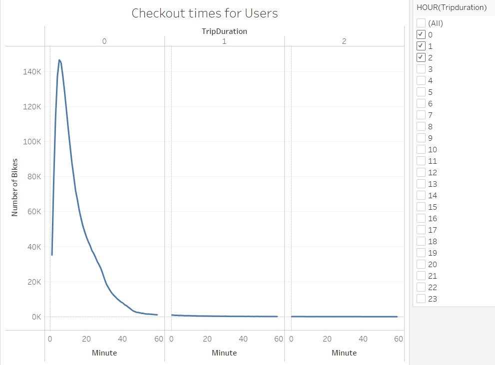
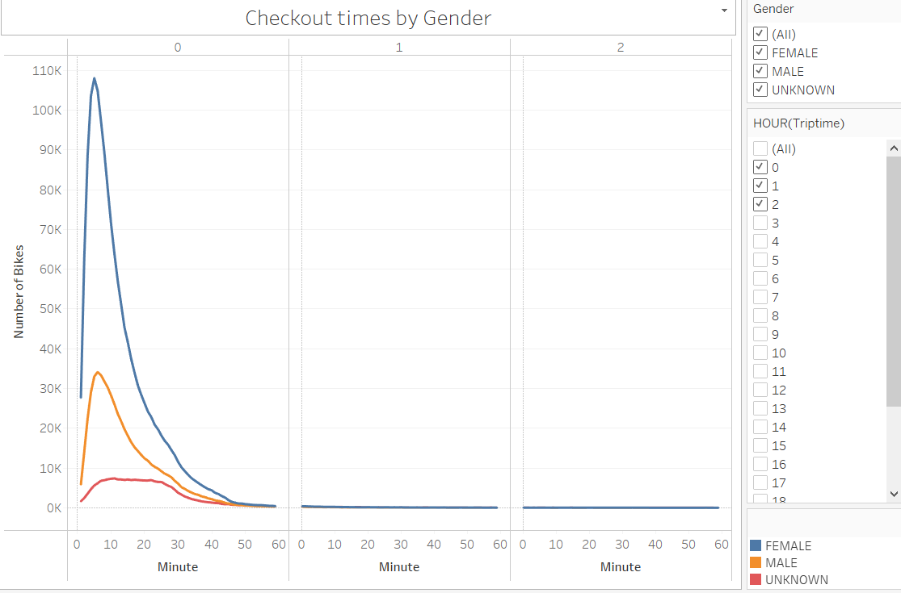
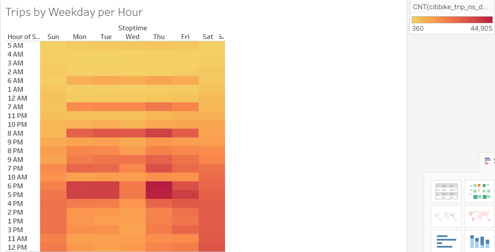
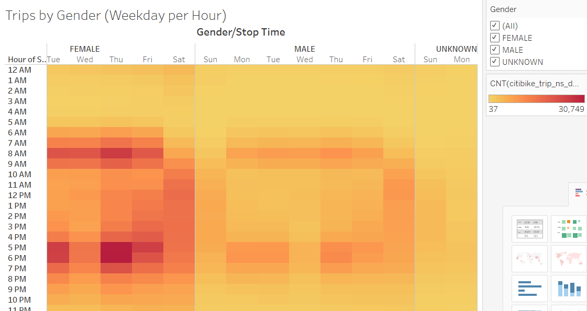
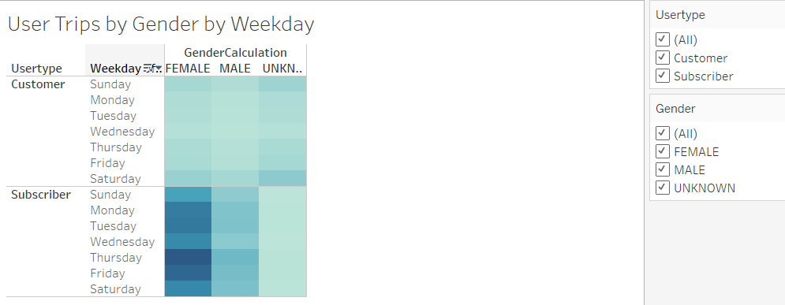
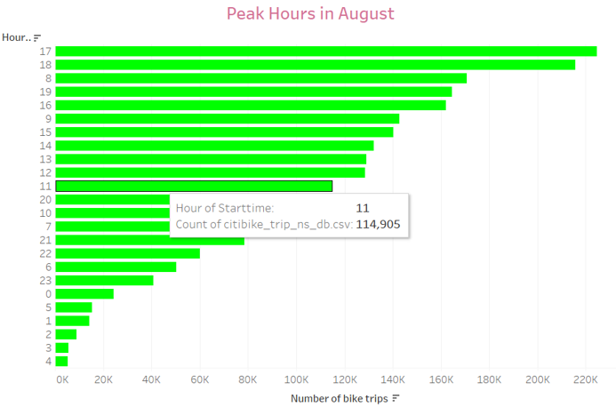
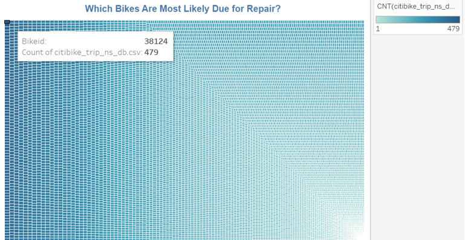
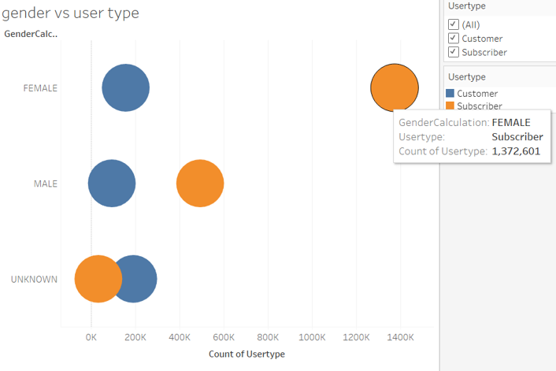
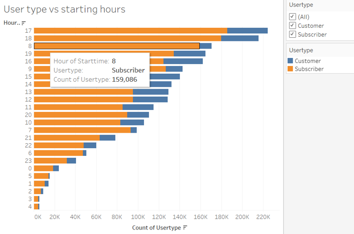

# Des Moines, Iowa bike-share company using NYC CitiBike data in Tableau Public
## Overview of the analysis:
Data Viz with Tableau Public for bikesharing company in Des Moines needs to be created. NYC Citibike August 2019 dbase is used but need to keep in mind that it is for Des Moines region in Iowa. I used Tableau Public for this project to present a business proposal for a bike-sharing company idea for Des Moines. Created worksheets and a story to visualize key data from a New York Citi Bike dataset. 

Tableau can be used to transform any data into an engaging data story for any non-technical audience. Tableau Server allows you to privately share your visualizations with others. You can create your visualizations locally in Tableau Public and then you can upload your visualizations to Tableau Server. You will find the link to my Tableau server below. 

### Purpose: 
The purpose is to analyse and present August 2019 NYC bikeshare data story to shareholders and convince them that the NYC model would work for Des Moines as well and that they should invest. My Tablaeu Viz will help investors determine whether they should invest in a bike-sharing program in Des Moines.

August data is used in this project because there is likely more traffic during the summer months. Database contains information about the trip such as trip duration, start-stop time, start-end station, station ID, station Lat/Long, bike ID, user type (customer, subscriber), gender (female,male,unknown) and birth year.

#### Tools:
I'm using Tableau Public 2021.4.3, Pandas library, Python, Jupyter notebooks and the given database 'citibike trip' history for August 2019 in NYC.

## Results:
First I used Pandas to convert integer datatype to a datetime datatype. Since August is a beautiful time of the year to rent a bike, I want to use the August data as a starting point to determine how many rides we could expect in the city of Des Moines. Using the Tableau Public I created the following visualizations. You can find the analysis of each visualization below the image. Each viz makes us think about what we absolutely need to know in order to create Des Moines bike-sharing program.

[You can access the bike-sharing project Tableau Visualizations and Analysis data story link in my Tableau portfolio here. ](https://public.tableau.com/app/profile/hulia/viz/DesMoinesbike-sharingstory/KeyoutcomesoftheNYCCitibike)

### The following are the five visualizations that I created for this challenge:

#### Checkout Times for Users
This line graph displays the number of bikes checked out by duration for all users, and the graph can be filtered by the hour. Gives info on each hour and minute of the trip, displaying the number of trips. For example during the first 6 minutes of the first hour 145,147 bikes were checked out. During the second hour of the trip the number of bikes checked out changes between 100-900. This information tells us that the first hour of any trip has the highest number of bikes. The graph can be filtered for 24 hr time slots.

#### Check Out Time by Gender
This line graph displays the number of bikes that are checked out by duration for each gender by the hour, and the graph can be filtered by the hour and gender. First hour of the trip female gender had the highest number of trips, followed by male then unknowns. The folowing hours has similar number of bike trips for all genders. With this information we could target the non female genders and find strategies to increase the number of bike trips for them. Another strategy should be done to increase the number of bikes after the first hour for all genders. 

#### Trips by Weekday per Hour
A heatmap is created showing the number of bike trips for each hour of each day of the week. According to the heatmap Thursday at 6pm there are 44,905 trips were made which is the highest. Mondays and Tuesdays and Thursdays are the busiest days for bike trips. Most busy hours starting at 5 and 6 pm. On weekends (Saturday and Sunday) the busiest times are in the middle of the day approximately between 10 am and 6 pm. Early hours of the day from 2 to 5 are not busy at all and can be used for repairs and cleaning.

#### Trips by Gender (Weekday per Hour)
A heatmap is created showing the number of bike trips by gender for each hour of each day of the week, and the heatmap can be filtered by gender. Females on Thursday making 31K trips starting at 5pm which is the highest for any gender. We can use this data to organize work-vacation hours for employees and decide on the number of employees on each workday and for busiest hours. We can also find strategies to have non-female genders to do more trips on weekdays instead of weekends.

#### User Trips by Gender by Weekday
A heatmap is created showing the number of bike trips for each type of user and gender for each day of the week, and you can filter by user and gender. The graph has weekdays and user type on y-axis and gender on x-axis. It is clear that the Thursdays are the female subscribers day and the most trips are made on Thursdays by female subscribers. Darker green shows us that Mon, Tue, Thurs and Fri are the busiest for female and male subscribers but Saturdays are busiest for one-time unknown gender customers with over 55K. Looking at the customers’ data we can see significant less trips throughout all genders during the weekends except unknown gender.

### The following are the two visualizations I created in this module.

#### What Are Peak Riding Hours in the Month of August
A key piece of data we need is the peak usage hours for the month of August. This will help us get a better idea of how many bikes we might need in Des Moines, as well as figure out during which parts of the day we'll need the most bikes. For example, if we need to do maintenance on a bike, knowing the peak usage hours will help us plan for the best time to do that."Starttime" dimension, is a good indicator of when customers tend to begin their bike rides. According to the graph between 5-7 pm is the most active time for biking. Based on this data we can do bike repairs between 2-5 am when bike riding is lowest.

#### Which Bikes Are Most Likely Due for Repair? 
This treemap graph above help us get an idea of how often each bike is used, and then note which ones are used most frequently. I identified the measures and dimensions needed to create the treemap. For example bike ID 38124 had 479 trips, 19840 had 4 trips. It is more likely that bike ID 38124 will need maintenance or repair sooner. This information will gives us idea on which bikes has a higher possibly of breakdown and how we can prevent it by monitoring the number of trips each bike makes.

## Summary: 
In summary, the core issue we need to think about is what we need to know in order to invest in bike-sharing project. Below is the high-level summary of the results and two additional visualizations that are performed with the given dataset.
### High-level summary of the results
#### Checkout Times for Users
This line graph displays the number of bikes checked out by duration for all users, and the graph can be filtered by the hour. Gives info on each hour and minute of the trip, displaying the number of trips. 
#### Check Out Time by Gender
This line graph displays the number of bikes that are checked out by duration for each gender by the hour, and the graph can be filtered by the hour and gender. First hour of the trip female gender had the highest number of trips, followed by male then unknowns.
#### Trips by Weekday per Hour
A heatmap is created showing the number of bike trips for each hour of each day of the week. According to the heatmap Thursday at 6pm there are 44,905 trips were made which is the highest.
#### Trips by Gender (Weekday per Hour)
A heatmap is created showing the number of bike trips by gender for each hour of each day of the week, and the heatmap can be filtered by gender. Females on Thursday making 31K trips starting at 5pm which is the highest for any gender.
### Additional visualizations

#### What is the trend of user types amongst different genders
The above pie chart shows us which gender tends to become a subscriber and which gender we need to target to become subscribers. Over 1.3M female customers are subscribers whereas 157,671 female customers are one-time users. Over 191K unknown gender is a one-time user. This is high number and we can target the unknown gender to become a subscriber. This could also give us an idea on the number and quality of bikes we need to purchase. We could also have a different type of bikes for subscriber and one-time users which would allow us to save on the cost of bikes, ie. one-time users getting a standard type whereas subscribed users getting a pro type bikes.

#### What is the trend of starting hour for different user types
The above image shows the trend of starting hour for different user types. We have more subscribed customer then one-time customer. Their start time are different. This will help us determine the types of customers we could expect for a bike-sharing company in Des Moines. Specifically, how the proportion of short-term customers to annual subscribers has changed. Subscribers tend to start early in the morning whereas one-time customers tend to start biking in the evenings. Since we have more subscribers we need to make sure we have available bikes during the early hours and adjust the maintenance or repair hours accordingly. 

